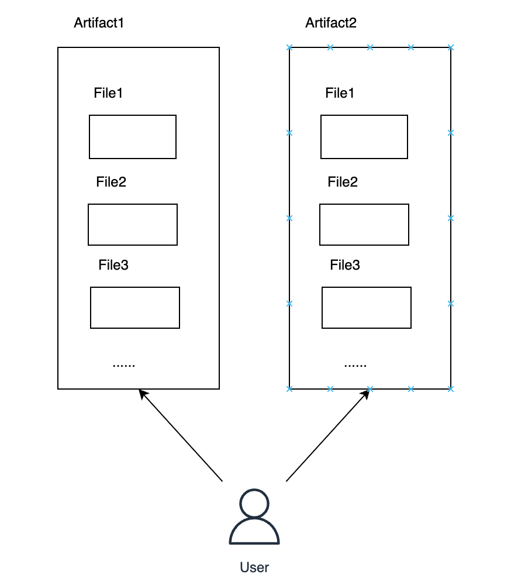
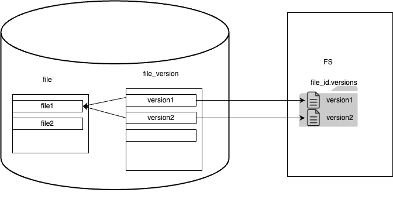
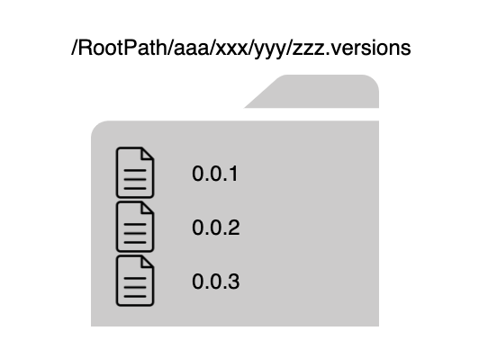
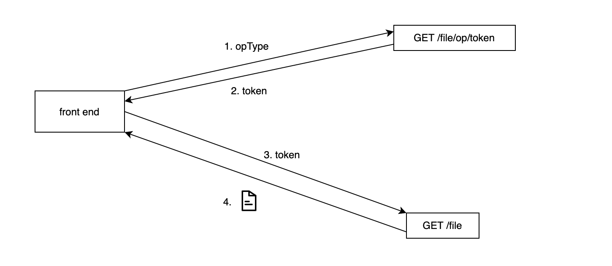
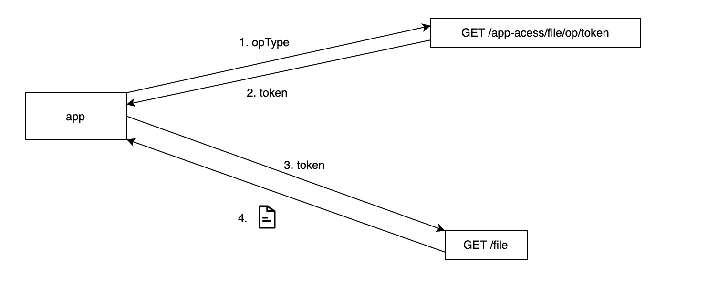

# 文件管理

## Artifact 与文件

两个最基本的实体是：Artifact 和文件。Artifact 可以理解为一个存储文件的容器，可以在 Aritfact 中上传文件或文件夹。Artifact、File 与用户的逻辑视图如图所示：

每个用户都可以创建多个 Aritfact，并可将一个 Artifact 共享到多个设备模板。

## 文件索引

文件存储采用数据库索引+Linux 文件系统相结合的形式。索引和文件系统的大致关系如下图：

如上图所示，数据库中不存储文件本身，而是存储文件的元数据。另外，为了方便管理文件版本，使用 file_version 表记录文件的各个版本的元数据。

文件版本的 path 属性指向了文件的最终存储路径。

## 文件存储

不存储所谓的文件本身，只存储文件的各个版本。如不指定文件版本，一个文件指的就是该文件的当前版本。

Artifact 存储：每个 Artifact 对应磁盘上一个具体的文件夹。所有的 Artifact 存储在一个指定的文件夹中（下称 RootPath），id 为 xxx 的 Artifact 相对 RootPath 的路径为：/.xxx.versions。

文件夹存储：每个文件夹对应磁盘上的一个文件夹，文件夹名就是文件夹的 file_id。

文件存储：每个文件都有自己的版本文件夹，文件的所有版本存储在该文件夹中。文件夹的名称由两部分组成：file_id + .versions。各个版本的文件名就是对应版本的版本号。例如，文件：/app/src/main.cpp （app，src，main.cpp 的 id 分别为 xxx，yyy，zzz）有 3 个版本，版本号分别是：0.0.1、0.0.2 和 0.0.3，文件所在的 Artifact 的 Id 为：aaa，那么该文件的版本目录如下图所示：

**数据库设计**

关键字段：

- cur_version_dir_path: 文件父路径。无论对于文件夹还是文件，该路径都是文件的 父路径
- cur_version_filename：文件名。对于文件来说，它是文件当前版本的文件名。对于文件夹，它就是文件夹的名称。
- cur_version_file_path：文件路径。对于文件，它是文件当前版本在磁盘上的路径。对于文件夹，它就是文件夹在磁盘上的路径。

**从数据库的角度如何定位一个文件**

由于文件夹和文件的存储方式不一样，所以 cur_version_file_path 不能作为通用的定位方式。

采用 cur_version_dir_path + cur_version_filename 的方式统一定位文件。

前端上传：

文件路径（以/开头）

后端解析：

拆分前端文件路径成：文件夹+文件名 形式。其中，文件夹转换成 idPath，之后通过父路径+文件名 的形式定位文件。所以至少需要两个函数：spliteFilePath(namePath) 将文件分为 prefix 和 name 两部分，convertNamePrefixToIdPrefix(namePrefix)将 name 转换成 id， byPrefixAndName(idPrefix, filename) 定位一个文件。可以将上述三个过程综合到过程 locateFile(namePath)中。

对于路径拆分，需要定义的是：

- 文件的路径只能以 /root 开头。
- 对于 /root ，prefix 是 "" ，name 是 root。
- 对于 /root/dir/file ，prefix 是 "/root/dir"，name 是 file

**如何获取一个文件的绝对路径**

采用 globalprefix + file.cur_version_file_path

**如何获取一个文件版本的绝对路径**

采用 globalprefix + file_version.path

**定义一个文件版本**

定位一个文件版本，可以通过 文件 id + 文件版本号定位，映射到数据库中，就是通过 **file_id + version_tag** 定位。其中，fileId 可以通过上述的 locateFile 过程获取，version 可以由用户提供（file_version.file_id + file_version.version_tag）。所以需要函数：byFileIdAndVersionTag(fileid, versionTag);

如果已经定位到文件，可以通过 文件 id + 版本 id 定位版本（file_version.id, file_version.file_id）。所以需要函数：byFileIdAndVersionId(fileid, vid);

**上传一个文件**

首先，获取文件可读路径，拆分成 prefix 和 name，然后，构建 prefix，因此增加函数 buildDirRecursively(prefix, artid); 由此获取到上传文件夹的 idpath，然后使用 prefix + name 定位文件，存在即定位其版本（fileid + vtag），不存在则建立版本，否则上传文件失败。

**修改文件名**

前端上传文件可读路径。
首先，拆分 prefix 和 name，使用 prefix+newName 定位文件，存在即重复，报错。
然后，使用 prefix 和 name 定位文件，如果是文件，需要修改文件当前版本名（file.cur_version_filename）和文件版本名（file_version.file_name）。

对于文件夹，只修改 file.cur_version_filename

## Artifact 与设备模板

用户创建了 Artifact 后，可选择关联到指定的设备模板（设备模板的属主可以不是自己），所以 Artifact 与设备模板是多对多的关系。

## 文件操作权限控制

大致将文件的操作分为 4 类：查看（browse），下载（download），修改（modify），上传（upload）。

- 查看：查看 Artifact 中的所有文件夹及文件，查看所有文件的历史版本。
- 下载：下载 Artifact 中的所有文件夹及文件，及其历史版本。
- 修改：删除 Artifact，修改 Artifact 名，在 Artifact 中上传文件或文件夹，删除 Artifact 中的文件夹或文件，修改 Artifact 中文件夹或文件的名称。
- 上传：上传文件夹或文件到 Artifact 中。

文件权限：上述四种文件操作的集合，大致分为两种：可读写，只读。

- 可读写：可以执行所有 4 种操作。
- 只读：可以查看（browse），下载（download）。

文件权限控制逻辑：

- 用户可以对自己的 Artifact 执行所有上述 4 类操作。
- 对于共享到设备模板的 Artifact，在共享时指定设备模板的属主可以对文件进行的操作。设备模板属主对模板的 Artifact 能进行的操作范围将不超过共享时 Artifact 属主指定的操作。

为了达到权限控制的目的，后端将文件操作细分为两步，首先请求操作 token，再由 token 对文件进行操作。下图展示下载文件的大致步骤：

## 开放能力

对第三方 app 开放所有 4 中文件操作，与前端唯一不同的是，第三方应用调用 GET /app-access/file/op/token 请求文件操作 token。下面展示第三方 App 下载文件的步骤：

