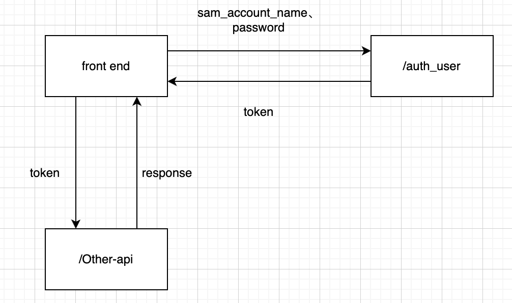

# 用户认证与权限管理

## 用户认证

使用用户的SamAccountName和Ldap密码进行认证。前端调用接口/auth_user认证用户，如果认证成功则返回login-token。访问后端其他接口需要带在Header中带上login-token。示意图如下：



token采用JWT，返回的token中存储用户的数据库自增ID。每次请求接口的token认证逻辑写在AuthenticationInterceptor 类中，先从token中取出用户ID，如果该ID在库中没有对应的用户记录，则token认证失败。

### 选择认证

并不是所有接口都需要认证，所以添加AuthLogin注解，需要认证login-token的接口使用AuthLogin标注即可。

### 存储用户信息

拦截器中认证用户后，将信息存储在ThreadLocal中，方便同一线程中获取用户信息。

## 权限模型

主要实体有：用户、权限、角色、后端API。四者的关系如下所示：		


角色与权限：系统中的每个角色都有角色，管理员可以向角色中添加权限，也可以向用户添加或删除角色。

权限与API：一个权限对应多个后端API，用户发送请求到后端时，由用户的角色查询到角色拥有的权限，进而查询到用户能访问的API，从而确定用户是否能访问当前的API。

## 超级管理员

系统有且只有一个超级管理员，通过系统配置文件添加，更新完配置文件后需要重启后端生效。

``` yml
system:
  config:
    admin:
      super-admin-account: admin
      super-admin-password: 123456
```

超级管理员可以进行所有操作，在接口权限鉴别时，如果用户的角色是超级管理员就直接放过。

注意，如果配置的超级管理员账号与系统中其他普通用户账号相同，则不创建超级管理员账号，配置失败。

