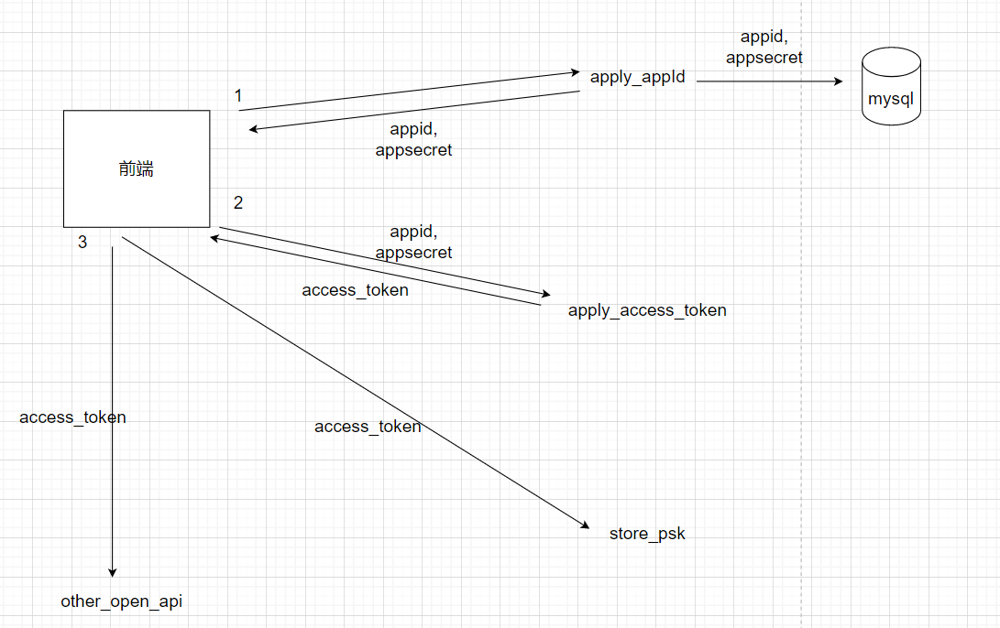

# 第三方应用

后端资源除了开放给用户，同时也开放部分资源给第三方应用。

用户可以申请自己的第三方应用（通过Web界面），然后通过接口/app_access_key/apply_access_token获取access_token，向开放接口发送请求时，将token置于Header的app-access-token字段中即可。

access_token的有效时间是2分钟，使用Redis实现延时效果。

access_token的认证逻辑写在AppAccessAuthInterceptor中。另外，同用户认证一样，为了方便控制接口是否需要验证access_token，给需要认证token的接口标注@AppAccessAuth注解即可。

目前开放的第三方接口如下表所示：

| 请求方法 | 接口路径                  | 接口描述          |
| -------- | ------------------------- | ----------------- |
| GET      | /app-access/file/op/token | 获取文件操作token |
| POST     | /device                   | 创建设备          |

