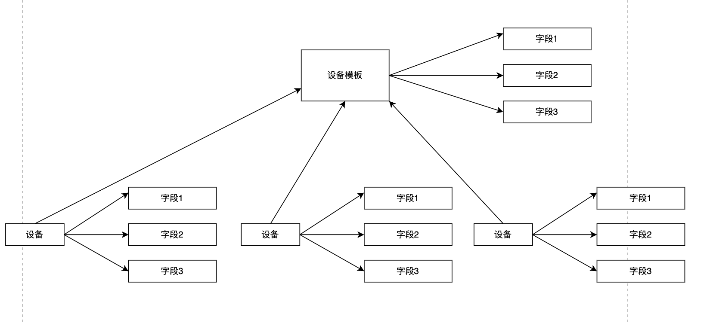

# 设备模板

本系统中，设备模板代表了一类设备，可以根据一个设备模板创建该类设备的不同实例。

## 设备模板与设备实例

就像类之于对象，设备模板体现了一类设备的共有特征，因此，一个设备模板就代表了一类产品。一个设备模板有很多模板字段，可以规定哪些字段是必须的，从模板创建设备实例时，需要上传所有必须字段。模板与设备的关系如下图所示：

为了便于体现设备字段与模板字段之间的关系，设备字段实体也持有指向对应模板字段的template_entry_id（在上图中没有体现出来）。

设备模板的每个字段都有类型，目前已有的类型只有两个：设备与共享秘钥和String。字段类型规定了字段值如何存储。不同类型的字段在前端的视图也不一样。

* String：普通的varchar（也可以扩展成Text），前端直接展示值本身即可。

* 设备与共享秘钥：普通的varchar，前端展示成设备的TOTP码。

下面是上述实体相关的表：

|  表名   | 说明  |
|  ----  | ----  |
| device  | 存储设备实例 |
| device_info  | 存储设备实例的字段 |
| device_template  | 存储设备模板 |
| device_template_entry  | 存储设备模板的字段 |
## 模板共有字段

**设备共有字段的必要性**

虽然设备模板的字段是可以自定义的，但是有些字段是所有设备模板都必须的，比如设备序列号，所以需要一个模板共有字段表，在创建设备模板时，无需额外上传共有字段，后端自动查询共有字段表并将其添加到新的设备模板中。

目前只有一个字段是共有字段：设备序列号。

## 设备查询

目前系统中对设备的查询需求只有一个，那就是根据设备序列号查询设备的 TOTP 代码（也就是查询设备的信息），因此后端需要根据某个字段的值查询某个设备，在这里就是根据设备的“设备序列号”字段查询设备。

**查询逻辑**

以查找“设备序列号”为 xxx 为例，由于字段名信息记录在 device_template_entry 中，所以可以先以字段名为“设备序列号”查找所有符合条件的设备模板字段，然后根据每个模板字段 的 id 查找 device_info 表（实例字段表），这样就找到了所有名为“设备序列号”的设备字段。再根据字段值 xxx 过滤得到的设备字段列表，取第一个作为结果，获取该设备字段实体的 device_id ,进而查询到目标设备。