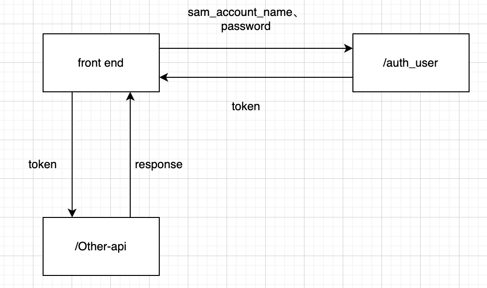
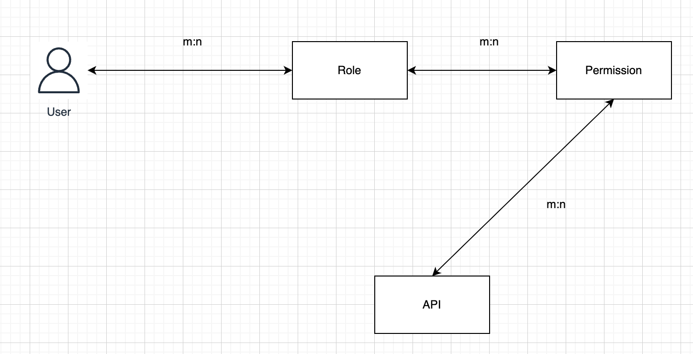

# 资源访问控制

后端的接口实际上是一种资源，为了方便后端资源的开发与维护，本系统将后端资源划分为以下3种：
* 用户使用的资源（下称用户接口）
* 第三方应用使用的资源（下称开放接口）
* 所有人都能使用的资源（下称通用接口）。

不同资源的受众、用途以及重要程度不尽相同，导致它们的开放性也有所差别。其中，还对用户接口的访问采取了权限控制，即不同角色的用户可以访问的接口是不一样的。

## 资源的开放性

用户接口和开放接口暴露的数据涉及每个用户的私人信息，因此需要较为严格的鉴权机制来管控；相比之下，通用接口通常标识着一些不重要的资源，比如系统中的一些常量，因此不需要任何权限控制，来者不拒。

### 接口的认证机制

**令牌**

无论是用户接口，还是开放接口，它们的访问都受到管制。必须有一套机制来实现这个目的。本系统采用token鉴权机制。

token鉴权机制的核心就是，在访问接口前，需要主动向服务器请求认证，在认证通过后得到服务器颁发的令牌，并访问接口时，在请求中携带由本系统颁发的、合法的令牌，也就是上文提及的 token ，以表明来访者的身份。

使用token鉴权的优势有很多，其一就是能保证系统后端是无状态的，这能简化系统后端的业务流程，也能保证系统在意外崩溃或处于维护状态时不丢失重要信息。token鉴权的第二个优势就是它相较于传统鉴权方式有着更高的灵活性。派发token的接口和鉴别token的逻辑可以不耦合在一起，同一个token也可以在一定时间内重复使用，这能有效避免每次需要鉴权时都需要上传自己的用户名和密码（因为这样做极增大了隐私信息泄露的风险）。与此同时，后端的设计者可以轻易地在token中设置不同的权限鉴别信息，已达到灵活鉴权的目的。


在本系统中，用户接口的token称为login-token，开放接口的token称为app-access-token。虽然二者在名称上有所差别，但是二者的设计意图都是一致的，它们都是接口受众的临时凭证。

在本系统中，无论是login-token还是app-access-token，其中只携带了相关实体的id，login-token中携带的是系统用户的id，app-access-token中则携带了第三方程序的id。

**令牌的颁发**

login-token的颁发由接口 /auth_user 接口颁发。前端访问该接口时，需要携带用户名和密码，/auth_user 接口认证用户名密码无误后，下发用户令牌。前端妥善保存令牌，在访问用户接口时，将该令牌置于header login-token 中，以表明用户身份。
app-access-token由接口 /app_access_key/apply_access_token 接口颁发，与 /auth_user 一样，来访者将 appid 和 appsecret 置于请求中，由接口认证通过后，下发token给调用者。前端妥善保存令牌，在访问开放接口时，将该令牌置于header app-access-token 中，以表明第三方应用身份。

**令牌失效**

上述提及的两种令牌都有一定的时效，调用者在必要的时候可以通过令牌时效查询接口查询令牌是否有效，如果令牌失效了，则需要重新向相应的令牌颁发接口申请新的令牌。login-token 的时效查询接口是 /token_expire，app-access-token 的时效查询接口是 /app_access_token/token-expire。


### 用户接口

用户接口，顾名思义，就是专门开放给系统用户的接口。之所以叫用户接口，并不是因为用户需要手动调用这些接口来获取信息，而是因为负责与用户交互的前端需要通过这些接口来获取数据并展示给用户。

既然用户接口的受众是用户，那么这些接口的访问者必须要证明自己是系统的合法用户。为了达到这个目的，本系统重规定，用户接口的访问者（也就是系统前端），必须在HTTP请求头中携带用户的token，以证明自己是系统中的合法用户。一个示例请求如下：

``` shell
curl -H "login-token: eyJhbGciOiJIUzUxMiIsInppcCI6I" "http://hostname:port/apiname"
```

在上述请求示例中：请求头中的 login-token 就用于承载能表明用户身份的token或其他信息。

### 用户Token认证机制

**颁发login-token**

前端调用接口 /auth_user，并携带用户的用户名和密码，如果经查询，数据库中有相应的用户记录，则生成token并通过响应返回前端。前端保存该 token ，可以用来访问其他用户接口，示意图如下：




**token方案**

login-token的有效期设置为两天左右。如果使用redis等缓存延时来实现时限鉴别则不太合适，因为如果redis在某些意外的情况下崩溃，那么所有的login-token都将重新计时，当然也可以在此基础上设计其他保险措施，不过这样就显得太过复杂。如果能利用token本身携带信息的能力，存储token颁发的时间，就能轻松鉴别token是否失效。

经过一番调研，决定采用比较成熟的JWT作为token的实现。只要在颁发token时将颁发时间点和token时效一并设置到token中，就相当于将token时效信息内嵌到了token自身。这样不但合理利用了token能携带信息的特性，也省去了额外的计时措施，降低了系统的复杂度。

### 开放接口

开放接口则本系统重指的是专门开放给第三方应用的接口。每个用户可以通过web端申请自己的第三方APP，然后通过接口 /app_access_key/apply_access_token 接口获取 app-access-token，在向开放接口发送请求时，将 app-access-token 置于请求Header中即可，大体逻辑与用户接口类似。

由于开放接口与用户接口认证使用的都是JWT，所以二者的token认证机制大体相同，因此不再赘述。

### 灵活配置接口的开放性

接口有3中开放性，那么如何在代码中实现这一点呢？也就是说如何让一个接口的访问需要经过用户认证，或者经过第三方应用的认证，又或者不需要任何认证？如何灵活配置某个接口使用不同的认证方式？

本系统中使用的是拦截器+注解。规定两个注解：@AuthLogin @AppAccessAuth 分别标识用户接口和开放接口，其他没有标注的都是通用接口，定义两个拦截器：AuthenticationInterceptor 和 AppAccessAuthInterceptor 分别处理用户认证和App认证的逻辑。 AuthenticationInterceptor 拦截器中判断目标接口是否标注了 @AuthLogin 注解，如果标注了，则拦截并认证。 AppAccessAuthInterceptor 拦截器则检查 @AppAccessAuth 注解。两个拦截器之间不需要有先后顺序。这样，变更某个接口的开放性，只要更换该接口的注解即可。

## 用户接口的权限鉴别

### 权限鉴别机制

上面说到对于用户接口，不同角色的用户可以访问的接口是不一样的。这需要一套权限鉴别机制来控制。

如果将每一个接口视为资源，那么需要设计角色到资源的关联，即，不同的角色关联到的资源是不一样的。这样用户来访时，只需在获取用户的角色后，在关联获取该角色能访问的资源，如果当前访问的资源在可访问资源列表中，则说明该用户有权访问该资源，从而达到权限控制的目的。

通常来说，我们可以对用户说某个角色具有某种权限，而不会说某个角色能够访问哪些接口。所以，为了便于权限控制，在角色和资源中间加一层：权限。权限是资源的集合，而角色是权限的集合，一个权限通常对应于一个完整的用户视角的功能。例如，如果用户想查看系统的配置并做出一些修改，那么他至少需要访问两个资源：list-config 以及 update-config 。那么可以料想到，该系统中有一个权限叫做“管理系统配置”。

最终，权限认证的主要实体有：用户、角色、权限、后端资源（API）。四者的关系如下所示：



### 权限鉴别的实现

同接口的认证一样，可以采用拦截器+注解的方式灵活配置接口的权限。设置注解： @Permission ，设置拦截器： AuthorizationInterceptor 。 AuthorizationInterceptor 只拦截被注解 @Permission 标注了的接口。

在拦截器中，获取来访者的角色，根据角色查询到来访者能访问的所有资源，再对比当前接口是否再可访问资源列表中，如果能，则放行，否则不能访问。

### 超级管理员角色

**超级管理员的必要性**

由于系统的资源是有权限的，而配置系统一般需要较高的权限，所以，为了便于系统的配置，设置一个类似于Unix系统root用户的超级管理员角色。

如上所述，超级管理员最大的价值就是配置和管理系统。由于系统部署之初所有用户只有默认的权限，需要一个操作不受阻碍的角色对系统进行初始化，而超级管理员用户则正好填补了这个空缺。例如，在系统部署之后，通常需要根据用户需求自定义各种角色，并为角色配置不同的权限，并将这些角色分配给不同的系统用户。

系统有且只有一个超级管理员，超级管理员可以进行所有操作，在接口权限鉴别时，如果用户的角色是超级管理员就直接放过。

**超级管理员的配置**

通过系统配置文件添加，更新完配置文件后需要重启后端生效。配置如下：

``` yml
system:
  config:
    admin:
      super-admin-account: admin
      super-admin-password: 123456
```

注意，如果配置的 super-admin-account 与系统中某个用户冲突，系统不会创建超级管理员用户。所以配置超级管理员时，建议取比较特殊的单词，比如 admin 、 superAdmin 等等。

